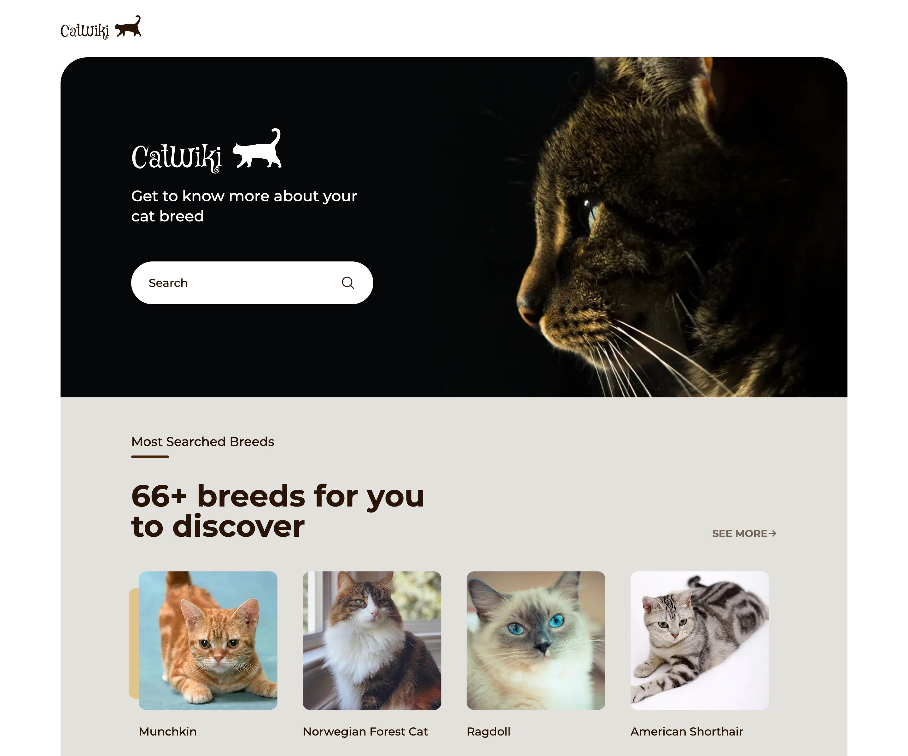
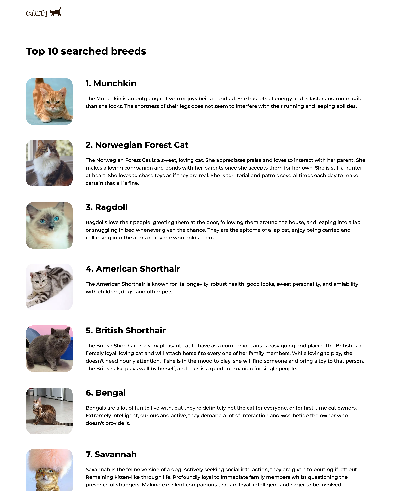
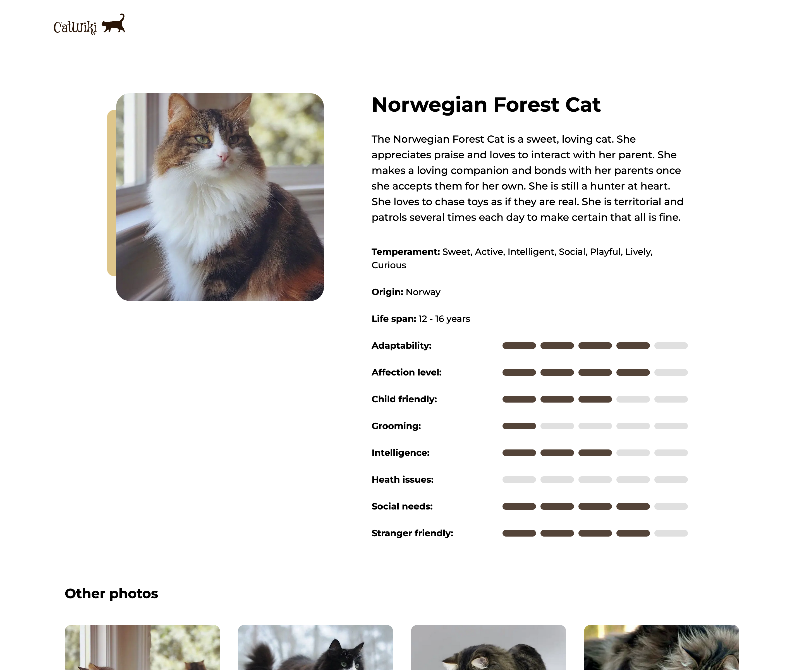
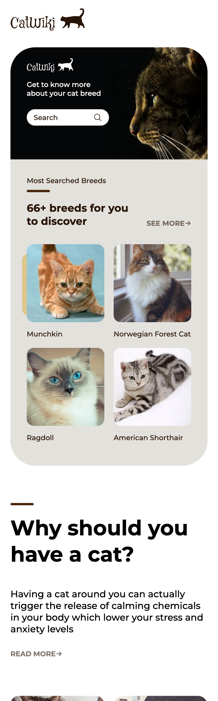
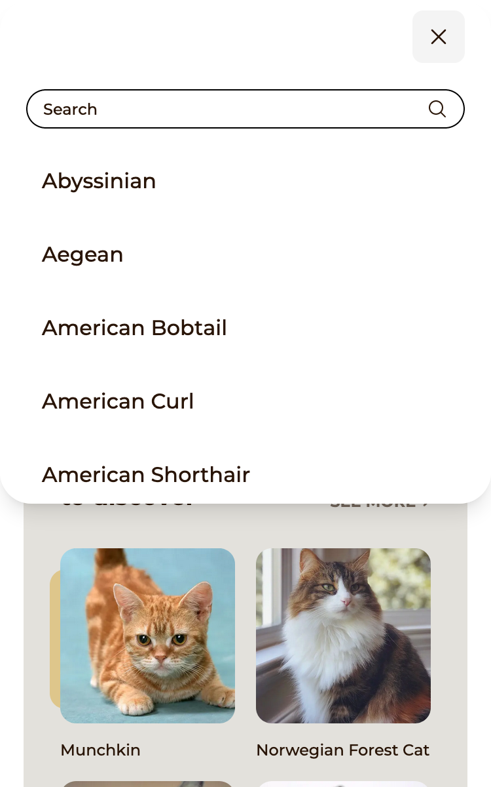
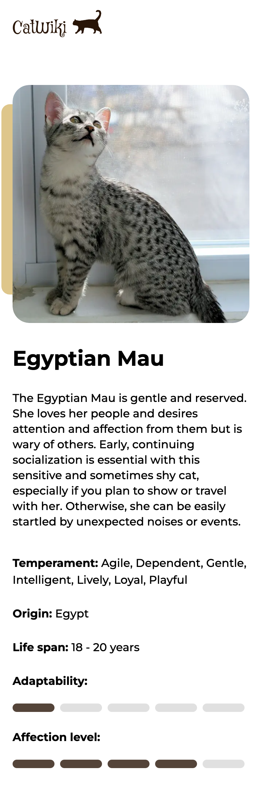

<!-- Please update value in the {}  -->

<h1 align="center">Cat Wiki</h1>

   Solution for a challenge from  <a href="http://devchallenges.io" target="_blank">Devchallenges.io</a>.

  <h3>
    <a href="https://cat-wiki-ayakh99.vercel.app/">
      Demo
    </a>
     | 
    <a href="https://github.com/ayakh99/cat-wiki">
      Solution
    </a>
     | 
    <a href="https://devchallenges.io/challenges/f4NJ53rcfgrP6sBMD2jt">
      Challenge
    </a>
  </h3>

<!-- TABLE OF CONTENTS -->

## Table of Contents

- [Overview](#overview)
  - [Built With](#built-with)
- [Features](#features)

<!-- OVERVIEW -->

## Overview

|         |                                      |                                                     |                                            |
| ------- | ------------------------------------ | --------------------------------------------------- | ------------------------------------------ |
| Desktop | Home  | Top 10       | Details  |
| Mobile  | Home   | Search modal  | Details   |

This project is built using the latest Next.js 13 features which support the interleaving of React server and client components. Google Analytics is used to support the top searched cat breeds feature and provide the summary on the home page.

### Built With

- [Next.js 13](https://nextjs.org/)
- [Tailwind](https://tailwindcss.com/)
- Google Analytics

## Features

Users can:

- search for cat breeds
- view most popular cat breeds summary on the homepage
- view the top 10 most searched cat breeds
- view breed details including description, temperament, origin, life span, adaptability, affection level, etc.
- view photos of the selected cat breed
- browse through photos using a lightbox
